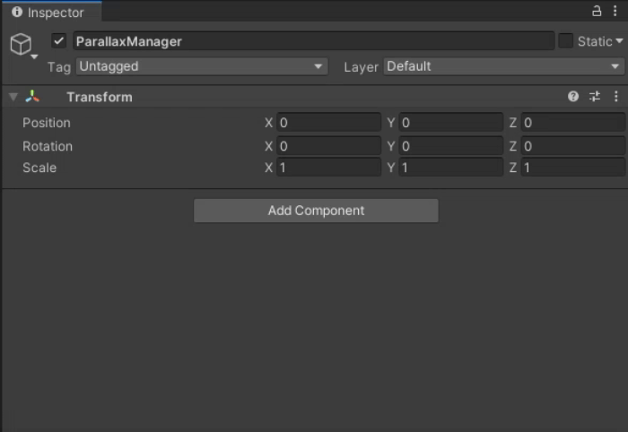

# UIParallaxLibary
Library of scripts for creating the parallax effect on UI elements in Unity.

[](https://github.com/RodionLodza/UIParallaxLibary/blob/master/LICENSE)
[](https://github.com/RodionLodza/UIParallaxLibary/watchers)
[](https://github.com/RodionLodza/UIParallaxLibary/stargazers)
<br />
<< [How does it work](#how-does-it-work) | [How to use](#how-to-use-this-library) | [Install](#how-to-install) | [Download](https://github.com/RodionLodza/UIParallaxLibary/raw/master/UIParallaxLibary.unitypackage) >>
<br />
<br />

## What does it look like

<br />

## How does it work
UI elements are usually displayed orthogonally, so it is impossible to create a parallax effect by moving and rotating the camera. However, no one is stopping us from moving and rotating UI objects in such a way as if the camera were moving, not the objects. Such a movement of UI objects gives a very realistic parallax effect.

> The library uses an accelerometer, not a gyroscope, because an accelerometer is present on more devices than a gyroscope.


<br />

## How to use this library
***First***, you need to place the main component of the parallax effect on the scene - the `UIParallaxEffect` script. It contains a set of `UIParallaxLayer` objects, which is an array of different UI elements with its parallax settings.

> ***Important!*** `UIParallaxEffect` must be initialized and updated in the Start and Update methods (for this you can implement your own `UIParallaxManager` controller class (see the example in the project), or through any other controller).



***Secondly***, you must define each `UIParallaxLayer` in the `UIParallaxEffect` component. `UIParallaxLayer` has several parameters that will be described below.


<br />

## Parameters UIParallaxLayer
* ParallaxLayerName - layer name (for ease of display)
* ObjectsRect - array of RectTransform objects that belong to this layer
* PosXMultiplier - the value at which the X position in the anchoredPosition of the objects changes
* PosYMultiplier - the value at which the Y position in the anchoredPosition of the objects changes
* InterpolationSpeed - parallax speed, in other words, the speed at which layer objects move and rotate

## How to install?
1. Download `UIParallaxEffect.unitypackage` and using UnityPackageManager.
2. The Unity Package Manager (UPM) is a new method to manage external packages. It keeps package contents separate from your main project files.

Modify your project's Packages/manifest.json file adding this line:
```"com.lodza.uiparallax": "https://github.com/RodionLodza/UIParallaxLibary.git#package-branch"```

To access classes inside of this package you will need to add a reference to com.lodza.fastpool.asmdef to your project's assembly definition file.
<br />

## License
* [MIT](https://github.com/RodionLodza/UIParallaxLibary/blob/master/LICENSE)
